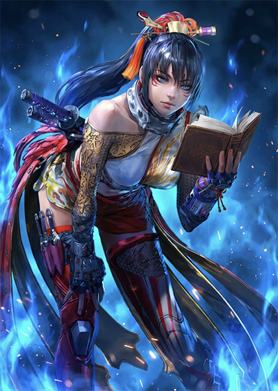

# Кунимицу т8
TBD под тайтл

> [!CAUTION]
> Текст документации в разработке. Будет приведён в порядок в течении первых недель выхода персонажа в продакшен.

## Методичка

> Место для первой цитаты TBD

> Место для второй цитаты TBD

> [!NOTE]
> Политика вклада в документацию (как внести сюда свои открытия и идеи):
> 1) Открыть PR на гитхабе напрямую и связаться с автором (см. раздел "Ссылки")
> 2) Репортить новые идеи / видеоклипы / тексты в "Tekken Git Gud" Discord сервер и тегнуть автора в канале по персонажу (см. раздел "Ссылки")

Подразумевается, что ты уже знаешь терминологию файтинг игр и нотации атак в Теккене. Иначе – смотри видео о нотациях для начинающих игроков

_дата обновления документа 10.02.2026_

## Содержание

- [О персонаже](#сводка-о-персонаже)
- [Паниши](#паниши)
- [Развитие оффенса, рашдаун, стаггер преша](#развитие-оффенса-рашдаун-стаггер-преша)
- [Развитие оффенса, гиммик, кенселы, фейк преша](#развитие-оффенса-гиммик-кенселы-фейк-преша)
- [Хит система](#хит-система)
- [Миксапы](#миксапы)
- [Броски и оки после бросков](#броски-и-оки-после-бросков)
- [Контрхиты, фреймтрапы](#контрхиты-фреймтрапы)
- [Пушбек сетапы и спейсинг трапы](#пушбек-сетапы-и-спейсинг-трапы)
- [Кроссапы](#кроссапы)
- [Кипаут](#кипаут)
- [Нокдауны, оки, игра у стены, сетапы с мити (плавающие кадры)](#нокдауны-оки-игра-у-стены-сетапы-с-мити-плавающие-кадры)
- [Трекинг](#трекинг)
- [Уникальные защитные механики и места применения](#уникальные-защитные-механики-и-места-применения)
- [Комбо теория](#комбо-теория)
- [Как играть против Кунимицу?](#как-играть-против-кунимицу)
- [Уникальные интеракции VS персонажа N](#уникальные-интеракции-vs-персонажа-n)
- [Ссылки на дополнительные материалы](#cсылки-на-дополнительные-материалы)

### Сводка о персонаже
TBD о персонаже

### Паниши
TBD

Таблица панишей на блоке (стендинг):

| Кадры  | Нотация | Св-ва |
|-----------|-----------|-----------|
| i10  | -  | - |
| i11  | -  | - |
| i12  | -  | - |
| i13  | -  | - |
| i14  | -  | - |
| i15  | -  | - |
| iX  | -  | - |

Таблица панишей на блоке (крауч):

| Кадры  | Нотация | Св-ва |
|-----------|-----------|-----------|
| i10  | -  | - |
| i11  | -  | - |
| i12  | -  | - |
| i13  | -  | - |
| i14  | -  | - |
| i15  | -  | - |
| iX  | -  | - |

Панишмент виффов:
Панишмент в спину:

### Развитие оффенса, рашдаун, стаггер преша
Варианты с малым риском не требующие от противника хорошего знания матчапа

### Развитие оффенса, гиммик, кенселы, фейк преша
Варианты с высоким риском работающие лучше если противник матчап знает хуже

### Хит система
Открывающиеся возможности в хит системе, новые лаунчеры, хит преша

### Миксапы
Накрутить там и сям

### Броски и оки после бросков
Лендим грабы, делаем оки

### Контрхиты, фреймтрапы
Стратегии и атаки против жмунек

### Пушбек сетапы и спейсинг трапы
Толкаемся в виффпаниши

### Кроссапы
Когда противник держит назад, а стало вперёд

### Кипаут
Что нажать по воздуху

### Нокдауны, оки, игра у стены, сетапы с мити (плавающие кадры)
Смотрите, он не умеет вставать

### Трекинг
Что жать против Лили плееров

### Уникальные защитные механики и места применения
Куда нажать ub3 или перри

### Комбо теория
Ссылка на английскую документацию по комбам

### Как играть против Кунимицу?
Антигайд для страдающих в матчапе, желательно видео, желательно 3-5 минут

### Уникальные интеракции VS персонажа N
Ревардные краши/опшен селекты vs конкретных чаров.
Группируем по персонажам

### Cсылки на дополнительные материалы
1) Телеграм автора http://t.me/ar_akimy

2) EN дискорд по персонажу  https://discord.gg/XPXRWuY

3) RU дискорд https://discord.gg/dPM7bwypWR с темой по персонажу https://discord.com/channels/563229394232016896/1467554782066774280 