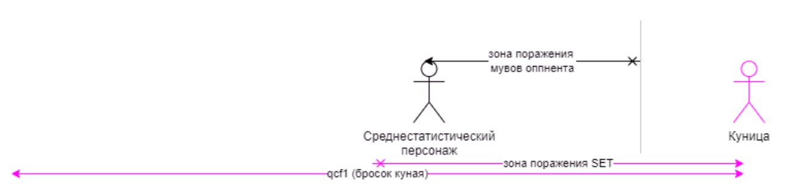
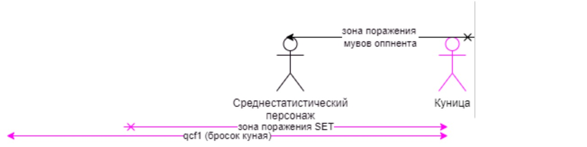

# Кунимицу т8
> Какой-то там спектральный вор

> [!CAUTION]
> Текст документации в разработке. Будет приведён в порядок в течении первых недель выхода персонажа в продакшен.

_Дата последнего обновления документа 30.05.2026_

## Методичка

> [!NOTE]
> Политика вклада в документацию (как внести сюда свои открытия и идеи) одно из:
> 1) Открыть PR на гитхабе
> 2) Репортить новые идеи / видеоклипы / тексты в "Tekken Git Gud" Discord сервер и тегнуть автора в канале по персонажу (см. раздел "Ссылки")

Подразумевается, что вы уже знаете терминологию файтинг игр и нотации атак в Теккене. Иначе – смотри видео о нотациях для начинающих игроков

## Содержание

- [О персонаже](#сводка-о-персонаже)
- [Паниши](#паниши)
- [Развитие оффенса, рашдаун, стаггер преша](#развитие-оффенса-рашдаун-стаггер-преша)
- [Развитие оффенса, гиммик, кенселы, фейк преша](#развитие-оффенса-гиммик-кенселы-фейк-преша)
- [Хит система](#хит-система)
- [Миксапы](#миксапы)
- [Броски и оки после бросков](#броски-и-оки-после-бросков)
- [Контрхиты, фреймтрапы](#контрхиты-фреймтрапы)
- [Пушбек сетапы и спейсинг трапы](#пушбек-сетапы-и-спейсинг-трапы)
- [Кроссапы](#кроссапы)
- [Кипаут](#кипаут)
- [Нокдауны, оки, игра у стены, сетапы с мити (плавающие кадры)](#нокдауны-оки-игра-у-стены-сетапы-с-мити-плавающие-кадры)
- [Трекинг](#трекинг)
- [Уникальные защитные механики и места применения](#уникальные-защитные-механики-и-места-применения)
- [Гаранты](#гаранты)
- [Комбо теория](#комбо-теория)
- [Как играть против Кунимицу?](#как-играть-против-кунимицу)
- [Уникальные интеракции VS персонажа N](#уникальные-интеракции-vs-персонажа-n)
- [Ссылки на дополнительные материалы](#cсылки-на-дополнительные-материалы)

### Сводка о персонаже
Про лор и присутствие персонажа в серии игр Tekken можно почитать здесь https://tekken.fandom.com/wiki/Kunimitsu

Ключевой гиммик персонажа – позволяет быстро сокращать дистанцию с оппонентом за счёт SET стойки. У Кунимицы очень хороший блокпанишмент. Персонаж имеет много гиммик опций при этом не теряя в фундаментальных инструментах. Персонаж имеет сильную BT игру

-----------------

### Глоссарий стоек
`SET` командный деш, мануальный вход `f3`\
`KAT` телепорт стойка с эвейзив мувами, мануальный вход `1+2`\
`BT` стойка спиной к противнику, мануальный вход `b3+4`

-----------------

### Паниши
Таблица панишей на блоке (стендинг):

| Стартап  | Нотация | Урон | Св-ва | Примечание |
|-----------|-----------|-----------|-----------|-----------|
| i10  |ff4,2|34| KND/Wallsplat m,m| $${\color{orange}Джастфрейм}$$, $${\color{green}Оптимальный}$$ (см.секцию под таблицами про ff42)|
| i10  |1,2,2|23| +5 h,h,h|Если хочется подвигаться после паниша, например рядом со стеной|
| i10  |1,2,2~b|23| BT+5 h,h,h |$${\color{green}Стейпл}$$|
| i10  |1,1|17| +6 h,m|Вероятно, может использоваться в ситуациях если персонаж противника может отменять рекавери в хайкраш стойку и второй удар его ловит для опшен селектов в 112, _проверить ws3 Анны, b1,1+2 Лео_|
| i10  |1,1,1+2|17| KAT+4 h,m |Для разыгровок из KAT|
| i12  |4,2|28| BT+6 h,h (jail)| $${\color{green}Стейпл}$$ паниш на 12, если нет возможности  воллсплата с ff42|
| i12  |2,2,1+2||h,m KAT| _дописать свойства_|
| i13  |f2,3|32| KND/Wallsplat h,h||
| i14  |cd2|Launch|m|Буфферится в блокстан|
| i14  |Heat Smah||m||
| i15  |df2|Launch|m | |
| i15  |uf3|Launch| m,h | |
| i19  |ub3+4|Launch| m | |

Таблица панишей на блоке (крауч):

| Стартап  | Нотация | Урон | Св-ва | Примечание |
|-----------|-----------|-----------|-----------|-----------|
| i10  | ff4,2  |34|KND/Wallsplat m,m|$${\color{green}Оптимальный}$$|
| i11  | ws4  |15|+5 m | |
| i12  | ws1,1  |26|+8 m,m| |
| i13  | ws2,1  |34|+9 Heat m,m| |
| i14  | cd2  |Launch |m| (проверить работает ли шорткат с df,df в крауче) |
| i15  | ws3 |Launch |m|  |
| i15  | uf3 |Launch |m,h|  |
| i19  |ub3+4|Launch |m| $${\color{green}Предпочтительный}$$ паниш для стаггер лоу атак вроде хелсвипов|

> [!TIP]
> `ff4,2`
>
> Первую f необходимо ввести до завершения блокстана, вторую f+2 после завершения блокстана. Паниш является оптимальным в случае standing для мувов до -11 (включительно) если рядом нет стены. Если стена рядом он оптимальней чем 4,2 и актуален до -13 (включительно) или до -14 если оппонент рекаверится в крауче. В случае ws-панишмента паниш является оптимальным до -12 (включительно)

Панишмент виффов:
- `df2`, `uf3` и `ub3+4` для атак с долгим рекавери
- `f2,3`, `qcf2`, `ff4,2` если рядом стена
- `qcf1` для виффов на фуллскрине

Панишмент пушбеков:
- `qcf1`
- `qcf2`

Панишмент в спину:
`2,2,2,2,2` должен зайти ровно в спину, оффаксис можно сесть 3 и 4 удары

-----------------

### Развитие оффенса, рашдаун, стаггер преша
TBD\
_Варианты с малым риском не требующие от противника хорошего знания матчапа_

-----------------

### Развитие оффенса, гиммик, кенселы, фейк преша
TBD\
_Варианты с высоким риском работающие лучше если противник матчап знает хуже_

-----------------

### Хит система
Heat Engagers:\
`f1+2` мид на близкой дистанции, тречит по SSR\
`SET 1+2` мид на дальней дистанции\
`ws2,1` i13 ws паниш\
`BT1,4` плюс на блоке h,h для фреймтрап из BT и ресета преши\
`KAT1,2` быстрая опция из KAT для фреймтрап из KAT, сейв

Уникальные атаки в хите:\
`u1+2` мид атака, на блоке переводит в +5 BT потребляет ~40% полоски, волсплат\
`db1+2` мид атака, -9 на блоке лаунчер потребляет ~50% полоски, тречит SSL\
`KATd1+2` лоу атака, -14 на блоке, можно получить волсплат, эвейзив, потребляет ~80% полоски\

-----------------

### Миксапы
*FC миксап*:\
Миксап из крауча между `FC1+2` и `ws3` / `ws2,1`\

*BT миксап*:\
Миксап из стойки спиной после перехода с +5 и выше. BT – основная миксап стойка Кунимицы\
Опции:\
`BT1+2` - Самая безопасная, мидчек + тречит попытки сайдстепов\
`BTf1+2` - Мид лаунчер. Если оппонент предсказывает лоу или грабы, харддакает. -13 на блоке.\
`BT2+4` или `BT1+3` Дженерик грабы (анимация граба скрыта и выглядит как на 1+2 разрыв)\
`BT1+4` - командный граб, высокий урон\
`BTd2` - хайкраш лоу ножом, не перрится -13 в блок, плюс на хите, контрхит св-ва + тречит\
`BT4` - ресет преши в SET +6, хоминг\
`BT1,4` - ресет преши, фреймтрап

-----------------

### Броски и оки после бросков
`1+3`, на 1 или 2\
`2+4`, на 1 или 2, можно попытаться добавить сверху `qcf2` если человек поднимается через `u` или сайдроллится, если оппонент вейкапается `b` - то `qcf2` виффает\
`f1+4`, на 1. Граб ногой (как у Маршала), сайдсвитчит оставляет в ситуации на разрыве BT к BT в -3 у кунимицы, хорошо чтобы отойти от стены, даёт `qcf2` гарант, если оппонент упал к стене\
`uf1+2`, на 1+2, хорошая дистанция после разрыва\
`BT1+4`, высокий урон

-----------------

### Контрхиты, фреймтрапы
`CH b2` основной контрхит мид, сейв. Хорошо подойдёт для интерраптов хайкраш сетапов и сабаки-перри\
`CH 1,2,4` 10фреймовый контрхит. Нокдаун волсплат.\
`df1,(CH 3)` второй удар - контрхит лаунчер на много урона, есть делей после `df1`\
`CH d1` гарант `ws2,1` [см.гаранты](#гаранты)\
`CH b1` окно линка в 12 кадров [см.гаранты](#гаранты)\
`CH ss2` гарант в `BT1,4` [см.гаранты](#гаранты)\
`CH SET2` контрхит лаунчер с хорошей дистанцией

-----------------

### Пушбек сетапы и спейсинг трапы
TBD

-----------------

### Кроссапы
TBD

-----------------

### Кипаут
Встречаем  `b2` клозрейндж `df2` или `KAT3` мидрейндж, `SET2` лонгрейндж, `qcf1` фулскрин

-----------------

### Нокдауны, оки, игра у стены, сетапы с мити (плавающие кадры)
TBD

### Трекинг
Попадает по SSR:
`f1+2` (heat engager), `df2`, `b2`, `BT2`, `b1+2`

Попадает по SSL:
`2,2`, `d1`, `df1`, `SET2`, `SET1+2` в нейтрале, некоторые продолжения с `1,1`, `db4`\
`HEAT db1+2` (мид лаунчер в хите)

Хорошо тречит в обе стороны: `BT1+2`, `qcf1+2`

Хоминги: `BT4`, `3,3`

-----------------

### Уникальные защитные механики и места применения
Армор: `d3+4` (в хите усиливается, становится мультихит/больше урона)\
Армор BT: `BT2` (хай, попадает по SSR)\
Перри: `b1+3`, `b2+4`, `BT3+4`\
Эвейжен: `ub3`

`b1,1,1,1,1` стринга полностью поглощается армором противника и можно зарекаверится и присесть хай-армор получив очень много урона. В некоторых случаях (зависит от фреймдаты) можно успеть нажать и стрингу и рейджарт на мид армор (см.каждый случай отдельно)

-----------------

### Гаранты
`CH d1` > `ws2,1`\
`HEAT ws2,1~f` > `qcf1+2`\
`CH ss2` > `BT1,4`\
`HEAT BT1,4~f` > `qcf1+2`\
`SET4,3` > `qcf2`\
`SET1,2,3` > `qcf2`\
`SET1,2,4` и `1,1,4` > `qcf2`\
`BT4` > `qcf2`\
`KAT2` > `qcf2`\
`CH b1` > линк до 12 кадров > `4,2` или `ff42`\
`f1+4` сайдсвитч граб возле стены > `qcf2`\
`1,1,(2) CH` > `qcf1`

----------------

### Комбо теория
[Спайк комбо эндеры, пока работает](https://x.com/Gt3UU9gb3Baw25U/status/2060570930439667989)
[Комбо-нотации из комьюнити доки Google Docs](https://docs.google.com/spreadsheets/d/1S1LPAKUBQYQHUn8LZha1_OKxwWjDWG1btjPtXgcd4v0/edit?gid=1778626471#gid=1778626471) 

-----------------

### Как играть против Кунимицу?
$${\color{red}Пока\spaceмало\spaceинформации}$$\
Будет дополняться, когда контрмеры будут хорошо изучены

$${\color{green}Самая\spaceбаза}$$

Куда сайдстепать:\
см. [трекинг](#трекинг) в основном SSR, но есть очень сильные кнопки, включая хит энгейджер, которые туда затречат

Стринги:\
`1,1` SSR закрывает все продолжения, редко после этого жать кнопки сразу (краши из KAT).\
`f4~f` Всё SSR после f4 кроме хит энгейджера SET1+2, можно сделать маленький степблок чтобы поблочить `SET1+2` но тогда слайд попадёт в хит\
`2,2,2,2` третий и четвёртый удары - хаи, иногда садиться под ними, можно нажать ws после третьего хая\
`2,2` не жать кнопки сразу после 2,2 (краши из KAT), жать только если эти кнопки ловят кунимицу из телепорта с KAT, если заигрывается с 2,2 в KAT то SSR после 2,2\
`df1,2` -10 часто панишить, особенно если за вами нет стены. Если доделывает `df1,2,2` панишить -14 из крауча. Если всегда респектить третий удар - кунимице слишком комфортно конфёрмить полную контрхит стрингу с `df1`\
`df1,3` - после получения информации, что игрок склонен нажать `df1,3` иногда садиться второй хит\
`BT1,4` - частенько садиться второй хит\
`SET1,2` - теперь джейлит если выполняется без делея (с делеем второй удар можно сесть) SSR после получения `SET1,2` в блок закроет продолжения\
`db3,3,3,3..4` - манжи спины, при блоке начинают джейлить, спамить свой ws паниш до 13 кадров включительно. Если делает больше двух - третий можно заблокировать и так же интерраптить ws i13, если делает до конца - `ws4` в флоат-комбу, если недоделывает в четвёрку лаунч-панишабл\
`df3,2` - ледоруб, [актуально видео от Regular Dweller](https://youtu.be/yFgOHuXRjZA) за исключением св-в на втором ударе. Приседайте в ws4 в большинстве случаев, если постоянно кенселит в свои кнопки запихивайте свой мид лаунчер туда

В нейтрале:\
`SET2` и `SET3` *SSR*

> [!IMPORTANT]
> *Про SET*
>
> Встречать кнопкой "на реакцию" в стартап стойки SET очень рисковано. Не успеете. Жать кнопку на анимацию SET только если вы уверены, что будет кенсел SET~d в крауч. Не разрывайте дистанцию от кунимицы дальше дистанций своих атак. Бекдеш кенселы дальше зоны поражения своих атак – на руку кунимице для бесплатных SET

*Комфортная ситуация для кунимицы*

*Комфортная дистанция для вас*

`SET3` слайд:\
0 на хите (если был сделан с небольшого расстояния) и вы оба в крауче, кунимица в этом случае $${\color{red}не\spaceимеет}$$ примущества по фреймам. Планируйте свои действия при получении слайда в хит исходя из этого

Находясь спиной к стене:\
Легко получить сплат с хоминга `qcf1+2`, отходить от стены осторожно

Разрыв броска `f1+4`:\
Разрыв на "1". Надо подлабить, анимация хватания ногой как у Маршала. После разрыва ситуация BT к BT, кунимица в -3. Надо быть готовым

TBD\
_Антигайд нужен, желательно видео, желательно 3-5 минут_

-----------------

### Уникальные интеракции VS персонажа N
_Ревардные краши/опшен селекты/гиммики vs конкретных персонажей._\
TBD

\
`uf1` бросок куная с печатью – антиэйр на хороший урон, если DJ взлетел

\
`ff42` и `df1` ОС паниши на армор с переходом в хантинг стойку.\
`f2,3`, `4,2` вифнут если будет переход в хантинг. `df2`, `uf3` попадут в блок если перехода не будет 

\
`uf1` бросок куная с печатью – антиэйр на хороший урон, если Jack взлетел

\
`uf1` бросок куная с печатью – антиэйр на хороший урон, если Yoshimitsu взлетел

> [!WARNING]  
> Yoshimitsu лаунчит флешкой `qcf1+2` заблокированную у стены (проверить)

\
`HEAT 3,1~f` предсказуемый хит-мув, перрить второй удар

> [!WARNING]  
> Lili лаунчит доделанную `db3,3...4` через `u3+4` (проверить)

\
`qcf2` панишит `3+4` браяна на средней дистанции (проверить) 
> [!WARNING]  
> Bryan интерраптит `db3,3...4` стрингу c помощью ws3 (контрхит лаунчер на много урона)

-----------------

### Cсылки на дополнительные материалы
1) [Зарубежный Google Docs по персонажу от комьюнити на английском](https://docs.google.com/spreadsheets/d/1S1LPAKUBQYQHUn8LZha1_OKxwWjDWG1btjPtXgcd4v0)
2) [EN дискорд по персонажу](https://discord.gg/XPXRWuY)  
3) RU дискорд [T8 Git Good](https://discord.gg/dPM7bwypWR)  [с темой по персонажу](https://discord.com/channels/563229394232016896/1467554782066774280) 